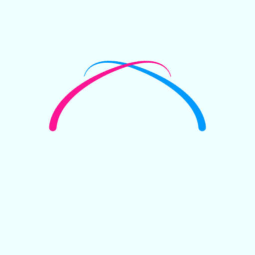
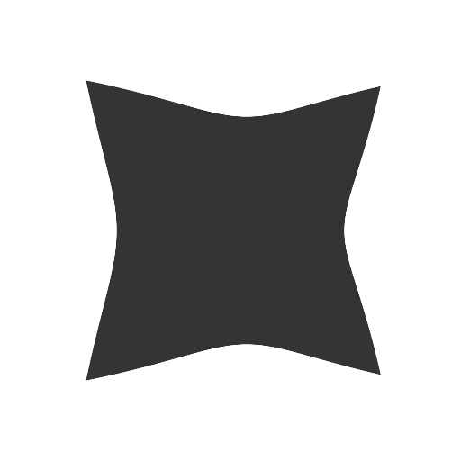

# Canvas-sketch & Pts.js

My experiments with combining [canvas-sketch](https://github.com/mattdesl/canvas-sketch) and [pts.js](https://github.com/williamngan/pts).

## Gifs
### Polygon

### Pond

### Arms
